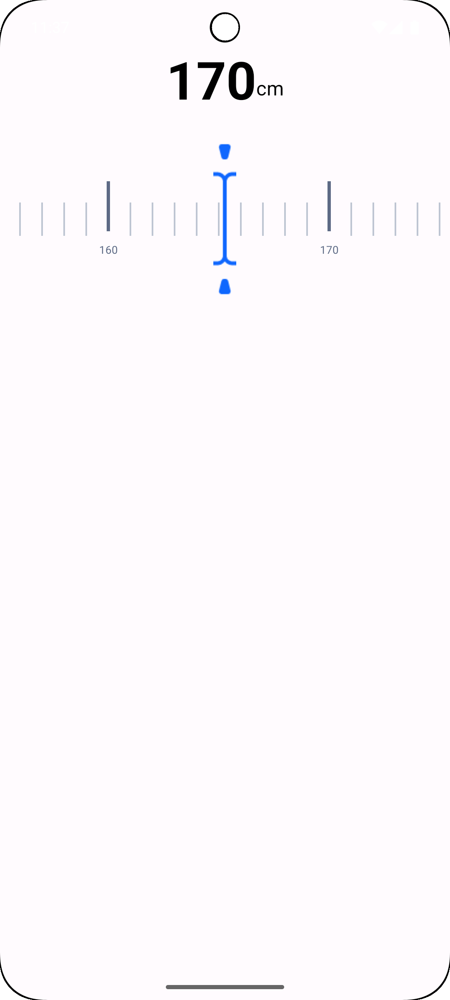

# 📏 Custom Ruler View – Android

Proyek ini merupakan latihan untuk membuat **Custom View di Android**, khususnya meniru tampilan penginputan tinggi badan seperti yang sering kita temui pada aplikasi kesehatan (misalnya Apple Health atau Google Fit).

---

## 🎯 Tujuan

- Mempelajari penggunaan **Custom RecyclerView** untuk menampilkan komponen seperti penggaris (ruler).
- Menerapkan **ConstraintLayout** secara presisi untuk memastikan elemen UI berada tepat di tengah.
- Membuat tampilan yang **interaktif, estetis, dan responsif**.

---

## 🧱 Fitur Utama

- Ruler horizontal yang menampilkan satuan **tinggi badan** (dalam cm).
- Marker panah (`marker.png`) yang berada tepat di tengah sebagai indikator nilai yang dipilih.
- Tick besar tiap kelipatan 10 dengan label angka.
- Tick kecil untuk satuan lainnya.
- Nilai terpilih ditampilkan besar dan jelas di bagian atas.
- Layout 100% berbasis **ConstraintLayout** agar responsif dan presisi di berbagai ukuran layar.

---

## 📷 Screenshot

Berikut tampilan antarmukanya:

---

## 🛠 Struktur File Penting

